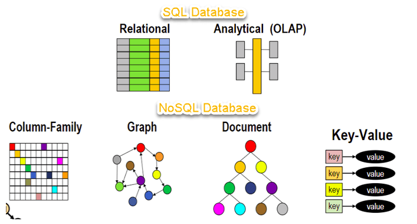
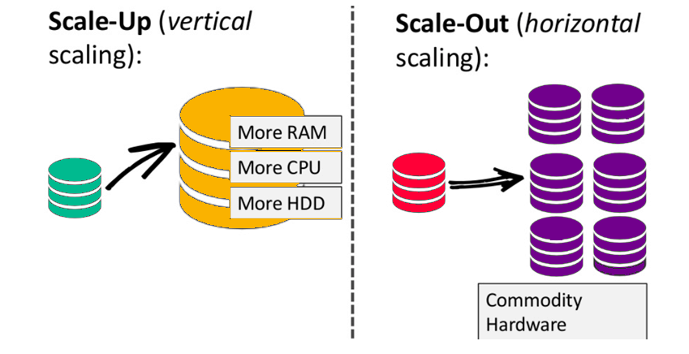

# Mongo DB

## Introduction
Mongo DB is an open-source NoSQL database. Before going to MongoDB let's talk about NoSQL. 
NoSQL database is a non-relational data management system which does not require a fixed schema. The main usage for NoSQL is for big, unstructured data

The RDBMS databases slow down the response times when working with huge amount of a data and the only solution for avoiding this is scaling the database vertically, which means to increase CPU, RAM, HDD volumes and this can become very expensive.
NoSQL suggests an alternative for this problem, and it is called "scaling out" or in other words distrubuting the data into multiple hosts whenever the load increases.

The main differences between SQL and NoSQL are
* SQL databases are relational, NoSQL databases are non-relational.
* SQL databases use structured query language and have a predefined schema. NoSQL databases have dynamic schemas for unstructured data.
* SQL databases are vertically scalable, while NoSQL databases are horizontally scalable.
* SQL databases are table-based, while NoSQL databases are document, key-value, graph, or wide-column stores.
* SQL databases are better for multi-row transactions, while NoSQL is better for unstructured data like documents or JSON.

One of the types of NoSQL is document bases databases, and MongoDB is one example for that kind. MongoDB stores data in BSON documents, which is the equivalent of the row in SQL databases.
The group of documents is called a collection, which is the equivalent for table in SQL. Each document is required to have _id, which should be unique and immutable and can be of any type, except array. Mongodb creates an index on _id automatically. The default for the _id is ObjectId type(MongoDB).

### Queries
Mongodb has basic operations for creating/reading/updating/deleting the data. 
1. insertOne/insertMany
2. findOne/find (Operators, Pagination)
3. updateOne/upsert/updateMany
4. deleteOne/deleteMany

### Aggregations
The aggregation framework allows you to analyze your data in real time. Using the framework, you can create an aggregation pipeline that consists of one or more stages. Each stage transforms the documents and passes the output to the next stage.
output from one command is passed as input to the next command when you use piping, output from one stage is passed as input to the next stage when you use the aggregation pipeline.
The aggregation framework has a variety of stages available for you to use. Some examples are
* $match
* $group
* $sort
* $limit
* $project
* etc.

### Documentation
https://www.mongodb.com/docs/

## Mongoose

Mongoose is a Node JS-based Object Data Modeling (ODM) library for MongoDB(Something like ORM). t manages relationships between data, provides schema validation, and is used to translate between objects in code and the representation of those objects in MongoDB.
### Terminology
* Collections
* Documents
* Field(or attributes) - is similar to columns in SQL table
* Schema - A Mongoose ‘schema’ is a document data structure (or shape of the document) that is enforced via the application layer.
* Models - are higher-order constructors that take a schema and create an instance of a document equivalent to records in a relational database.
  A Mongoose model is a wrapper on the Mongoose schema. A Mongoose schema defines the structure of the document, default values, validators, etc., whereas a Mongoose model provides an interface to the database for creating, querying, updating, deleting records, etc.
  
### Usage 
1. Referencing
2. Creating
3. Updating
4. Deleting
5. Defining schemas, validators, indices

### Documentation
https://mongoosejs.com/docs/