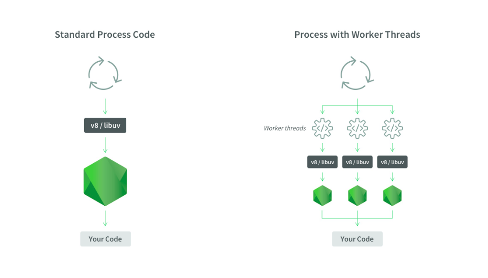

# Worker threads
When a Node.js process is launched, it runs:
* One process
* One thread
* One event loop
* One JS Engine Instance
* One Node.js Instance

One process: a process is a global object that can be accessed anywhere and has information about what’s being executed at a time.

One thread: being single-threaded means that only one set of instructions is executed at a time in a given process.

One event loop: this is one of the most important aspects to understand about Node. It’s what allows Node to be asynchronous and have non-blocking I/O, — despite the fact that JavaScript is single-threaded — by offloading operations to the system kernel whenever possible through callbacks, promises and async/await.

One JS Engine Instance: this is a computer program that executes JavaScript code.

One Node.js Instance: the computer program that executes Node.js code.

In other words, Node runs on a single thread, and there is just one process happening at a time in the event loop. One code, one execution, (the code is not executed in parallel). This is very useful because it simplifies how you use JavaScript without worrying about concurrency issues.

The reason it was built with that approach is that JavaScript was initially created for client-side interactions (like web page interactions, or form validation) -- nothing that required the complexity of multithreading.    

But, as with all things, there is a downside: if you have CPU-intensive code, like complex calculations in a large dataset taking place in-memory, it can block other processes from being executed. Similarly, If you are making a request to a server that has CPU-intensive code, that code can block the event loop and prevent other requests of being handled.

A function is considered “blocking” if the main event loop must wait until it has finished executing the next command. A “Non-blocking” function will allow the main event loop to continue as soon as it begins and typically alerts the main loop once it has finished by calling a “callback”.

The best solution for CPU performance is Worker Threads. Browsers have had the concept of Workers for a long time.
Worker threads have:

* One process
* Multiple threads
* One event loop per thread
* One JS Engine Instance per thread
* One Node.js Instance per thread
As we can see in the following image:


The `worker_threads` module enables the use of threads that execute JavaScript in parallel. To access it:
```js
const worker = require('worker_threads');
```

What is ideal, is to have multiple Node.js instances inside the same process. With Worker threads, a thread can end at some point and it’s not necessarily the end of the parent process. It’s not a good practice for resources that were allocated by a Worker to hang around when the Worker is gone-- that’s a memory leak, and we don’t want that. We want to embed Node.js into itself, give Node.js the ability to create a new thread and then create a new Node.js instance inside that thread; essentially running independent threads inside the same process.

What makes Worker Threads special:

`ArrayBuffers` to transfer memory from one thread to another
`SharedArrayBuffer` that will be accessible from either thread. It lets you share memory between threads (limited to binary data).
`Atomics` available, it lets you do some processes concurrently, more efficiently and allows you to implement conditions variables in JavaScript
`MessagePort`, used for communicating between different threads. It can be used to transfer structured data, memory regions and other MessagePorts between different Workers.
`MessageChannel` represents an asynchronous, two-way communications channel used for communicating between different threads.
`WorkerData` is used to pass startup data. An arbitrary JavaScript value that contains a clone of the data passed to this thread’s Worker constructor. The data is cloned as if using `postMessage()`

API

* ```const { worker, parentPort } = require(‘worker_threads’)``` => The `worker` class represents an independent JavaScript execution thread and the `parentPort` is an instance of the message port
* ```new Worker(filename)``` or ```new Worker(code, { eval: true })``` => are the two main ways of starting a worker (passing the filename or the code that you want to execute). It’s advisable to use the filename in production.
* ```worker.on(‘message’)```, ```worker/postMessage(data)``` => for listening to messages and sending them between the different threads.
* ```parentPort.on(‘message’)```, ```parentPort.postMessage(data)``` => Messages sent using `parentPort.postMessage()` will be available in the parent thread using `worker.on('message')`, and messages sent from the parent thread using `worker.postMessage()` will be available in this thread using `parentPort.on('message')`.

Example 

```js
const { Worker } = require('worker_threads');

const worker = new Worker(`
const { parentPort } = require('worker_threads');
parentPort.once('message',
    message => parentPort.postMessage({ pong: message }));  
`, { eval: true });
worker.on('message', message => console.log(message));      
worker.postMessage('ping'); 
```

What this essentially does is create a new thread using a new Worker, the code inside the Worker is listening for a message on parentPort and once it receives the message, it is going to post the message back to the main thread.
`node --experimental-worker` You have to use the --experimental-worker because Workers are still experimental.

[Official documentation](https://nodejs.org/api/worker_threads.html#worker_threads_worker_threads)